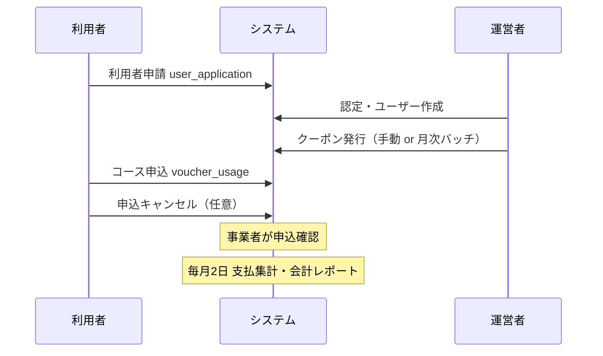
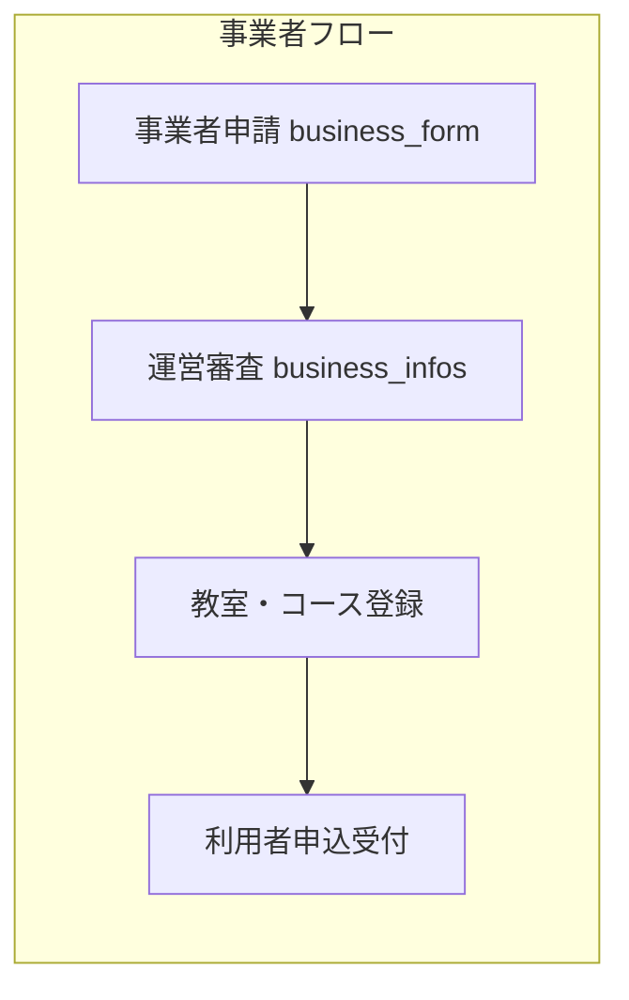

# 習い事バウチャー管理システム 仕様書

本ドキュメントは、現在のソースコードを元にしたアプリケーション仕様です。

---

## 1. システム概要

習い事クーポン制度における申し込み・管理システムである。利用者・事業者・運営者の3つの役割に対応したWebアプリケーションを提供する。サブドメイン単位のマルチテナント構成で、テナント（自治体）ごとに設定・データを分離している。

---

## 2. 技術スタック

| 区分 | 技術 |
|------|------|
| バックエンド | Laravel 12 / PHP 8.4 / MySQL 8.0 |
| フロントエンド | Blade テンプレート / Tailwind CSS v4 / JavaScript |
| 開発・品質 | PHPUnit, Larastan (PHPStan level 7), Laravel Pint, ESLint, Prettier, Stylelint |

---

## 3. 認証・認可

### 3.1 認証

- **利用者**: `/login`（GET: ログインフォーム、POST: ログイン）。ログアウトは `POST /user/logout`。
- **事業者**: `/business/login`（GET/POST）。ログアウトは `POST /business/logout`。
- **管理者**: `/admin/login`（GET/POST）。ログアウトは `POST /admin/logout`。

パスワードリセットは利用者・事業者それぞれに用意されている（`/user/forgot-password`, `/user/reset`、`/business/forgot-password`, `/business/reset`）。throttle は「10回/60分」でリセットリンク送信を制限している。

### 3.2 認可（ロール）

認可はロールベースで、`EnsureRole` ミドルウェアにより制御される。認証済みユーザーの `Role.name` が許可リストに含まれる場合のみアクセス可能。

| ロール名 | 表示名 | 説明 | 主なアクセス先 |
|----------|--------|------|----------------|
| super_admin | システム管理者 | 全システム管理者（グローバル） | 管理画面全体 |
| subdomain_admin | サブドメイン管理者 | サブドメイン内全管理 | 管理画面（当該サブドメイン） |
| subdomain_operator | サブドメイン作業者 | 業務操作・限定的管理 | 管理画面（参照・更新中心） |
| subdomain_viewer | サブドメイン閲覧者 | 参照のみ・レポート閲覧 | 管理画面（参照のみ） |
| subdomain_business | サブドメイン事業者 | 事業者向け機能 | `/business/*` ダッシュボード以降 |
| subdomain_user | サブドメイン利用者 | 利用者向け機能 | `/user/*` ダッシュボード以降 |

- 管理画面ルート: `role:super_admin|subdomain_admin|subdomain_operator|subdomain_viewer`
- 事業者ルート: `role:subdomain_business`
- 利用者ルート: `role:subdomain_user`

---

## 4. 機能一覧（役割別）

### 4.1 未認証で利用可能な機能

| 機能 | ルート例・備考 |
|------|----------------|
| ランディング | `GET /` |
| お知らせ | `GET /notices/{id}`, 添付DL, load-more |
| 概要・プライバシー | `GET /about`, `GET /privacy_policy` |
| FAQ・マニュアル | `GET /faq_user`, `GET /faq_business`, `GET /manual_user`, `GET /manual_business` |
| 習い事検索・教室詳細 | `GET /course/search`, `GET /course/{classroom}`, 教室画像DL |
| 教室登録申込 | `GET/POST /course/request`（コース申込依頼） |
| 事業者申請 | `GET /business_form`, confirm, store, complete |
| 利用者申請 | `GET /user_application`, confirm, store, complete |
| お問い合わせ | `GET/POST /contact` |
| 事業者登録案内 | `GET /business/registration` |
| API | 銀行一覧 `GET /api/banks`, 支店一覧 `GET /api/branches`, 郵便番号検索 `GET /api/postal-code/search`（throttle 60/分、フォームセッション検証） |

### 4.2 利用者（subdomain_user）

| 機能 | ルート例・備考 |
|------|----------------|
| ダッシュボード | `GET /user` |
| パスワード変更 | `GET/POST /user/password/change` |
| プロフィール | 編集 `GET /user/profile/edit`, メール・パスワードの更新 |
| お知らせ | `GET /user/notices/{id}`, 添付DL |
| 申込一覧・詳細・キャンセル | `GET /user/applications`, `GET /user/applications/{voucherUsage}`, `POST .../cancel` |
| コース検索・教室詳細・クーポン申込 | `GET /user/course/search`, `GET /user/course/{classroom}`, 申込 `GET/POST /user/course/{classroom}/{course}/application`（金額指定利用は course=-1） |
| 問い合わせ | `index`, `create`, `store`, `show`（resource inquiries） |

### 4.3 事業者（subdomain_business）

| 機能 | ルート例・備考 |
|------|----------------|
| ダッシュボード | `GET /business` |
| パスワード変更 | `GET/POST /business/password/change` |
| 事業者プロフィール | 編集・メール・パスワード・通知設定 |
| 教室 | 一覧・詳細・更新、画像DL（original/medium/thumbnail） |
| コース | 一覧・作成・詳細・編集・更新・複製 |
| お知らせ | `GET /business/notices/{id}`, 添付DL |
| 申込管理 | 一覧・詳細・更新（メモ）、エクスポート |
| レポート | `GET /business/reports` |
| 支払 | 一覧、月別PDF/CSV DL（`/business/payments/{year_month}/pdf|csv`） |
| 問い合わせ | index, create, store, show |

### 4.4 運営者（管理者ロール）

| 機能 | ルート例・備考 |
|------|----------------|
| ダッシュボード | `GET /admin` |
| レポート | `GET /admin/reports`（過去12暦月の月次指標。権限レベル40以上） |
| サブドメイン編集 | `GET /admin/subdomain/edit`, `PUT /admin/subdomain` |
| ユーザー管理 | resource `users`（CRUD） |
| 事業者管理 | 一覧・作成・編集・更新・有効/無効、CSVエクスポート、ログイン情報送信、申請書類DL、管理者用備考・添付DL、教室一覧・作成・編集・更新・有効/無効、コース一覧・作成・編集・更新・有効/無効、教室画像DL |
| 習い事種別 | `GET /admin/course-categories`。親分類: store / update / destroy。子分類: store / update / destroy。 |
| お知らせ | index, create, store, show, edit, update, destroy, 添付DL, geocode |
| 習い事リクエスト | index, show, update（course_requests） |
| 利用者申請 | 一覧・詳細・更新・エクスポート、書類DL |
| 受給者 | 一覧・詳細・更新、インポート、エクスポート、ログイン情報送信（一括/単体）、クーポン発行・失効 |
| クーポン | 一覧、export-csv、export-attribute-csv（vouchers） |
| 支払集計 | 一覧、全銀フォーマットDL、PDF |
| 会計報告 | `GET /admin/accounting-reports/download-csv`, `download-pdf`（一覧は支払集計に統合） |
| ダウンロード管理 | `GET /admin/downloads` 一覧、`GET /admin/downloads/{id}/download`（利用者CSV月次等のS3出力） |
| クーポン利用状況 | 一覧・エクスポートCSV・詳細・更新（coupon-usages） |
| お問い合わせ（contacts） | 一覧・詳細・更新 |
| 問い合わせ（inquiries） | 一覧・詳細・更新 |

---

## 5. 主要業務フロー

### 5.1 利用者まわり

1. 利用者が「利用者申請」から申込（user_applications）。
2. 運営者が申請を審査し、認定すると受給者（beneficiaries）・ユーザー（users）が紐づく。クーポン（vouchers）は手動発行または月次バッチで発行。
3. 利用者がログインし、コース検索→教室選択→クーポン申込を行うと、クーポン利用（voucher_usages）が作成される。必要に応じて利用者がキャンセル可能。
4. 事業者は申込一覧で確認。月次で支払集計（payment_aggregates）・会計報告が生成される。

### 5.2 事業者まわり

1. 事業者が「事業者申請」から申込（business_form → business_infos 等）。
2. 運営者が審査し、承認（status 更新・apply 等）すると事業者として利用可能になる。
3. 事業者が教室（classroom_infos）・コース（course_infos）を登録（事業者画面または管理画面から）。
4. 利用者からのクーポン申込が申込一覧に表示され、確認・メモ更新が可能。

### 5.3 データの流れ（概要）

- **利用者申請〜クーポン利用**: user_applications → beneficiaries / users → vouchers → voucher_usages → payment_aggregates
- **事業者〜教室・コース**: business_infos → classroom_infos → course_infos。voucher_usages は business_info_id, classroom_info_id, course_info_id を参照。
- **会計・支払**: payment_aggregates、accounting_report_downloads、business_payment_downloads で月次レポート・事業者向け支払明細を管理。

---

## 6. データベース

テーブル定義の詳細は **[DB定義書](DB定義書.md)** を参照すること。

### 6.1 主要エンティティ（論理名・物理名）

| 論理名 | 物理名 |
|--------|--------|
| サブドメイン | subdomains |
| ロール | roles |
| ユーザー | users |
| コース親分類・コース分類 | course_categories_parent, course_categories |
| 事業者情報 | business_infos |
| 教室情報 | classroom_infos |
| コース情報 | course_infos |
| お知らせ | notices |
| 問い合わせ（お問い合わせ） | contacts |
| コース申込依頼 | course_requests |
| 銀行支店マスタ | bank_branches |
| 受給者 | beneficiaries |
| バウチャー | vouchers |
| 利用者申込 | user_applications |
| クーポン利用 | voucher_usages |
| 問い合わせ（利用者等） | inquiries |
| 支払集計 | payment_aggregates |
| 会計報告ダウンロード | accounting_report_downloads |
| 事業者支払ダウンロード | business_payment_downloads |
| 管理画面ダウンロード | admin_downloads |

このほか、Laravel 標準の password_reset_tokens, cache, sessions, jobs 等がある。

---

## 7. API

いずれも `web` + `validate.form.session` + `throttle:60,1` を付与。

| メソッド | パス | 説明 |
|----------|------|------|
| GET | /api/banks | 銀行一覧 |
| GET | /api/branches | 支店一覧（銀行指定等） |
| GET | /api/postal-code/search | 郵便番号検索 |

---

## 8. バッチ・スケジュール

タイムゾーンは `Asia/Tokyo`。

| 実行タイミング | コマンド | 概要 |
|----------------|----------|------|
| 日次 0:00 | app:disqualify-expired-beneficiaries | 資格喪失となった受給者の処理 |
| 日次 0:05 | app:issue-monthly-vouchers | 月次クーポン発行 |
| 日次 0:10 | app:expire-vouchers | クーポン失効処理 |
| 毎月1日 0:00 | app:export-beneficiary-csv-monthly | 利用者CSV月次エクスポート（admin_downloads に登録） |
| 5分毎 | app:send-pending-decision-notices | 決定通知送信 |
| 日次 9:00 | app:send-daily-coupon-count-notifications | 日次クーポン件数通知 |
| 毎月2日 0:01 | app:aggregate-business-payments | 支払集計 |
| 毎月2日 0:05 | app:generate-monthly-accounting-reports | 会計レポート生成 |
| 5分毎 | app:check-correction-and-aggregate | クーポン利用の修正検知時、支払集計・会計レポート再実行 |

---

## 9. ディレクトリ・主要ファイル

| 区分 | パス・備考 |
|------|------------|
| ルート | `routes/web.php`（全Webルート）、`routes/console.php` |
| コントローラー | `app/Http/Controllers/`（User/, Business/, Admin/, Api/, Auth/ 等） |
| モデル | `app/Models/`（User, Role, Subdomain, BusinessInfo, ClassroomInfo, CourseInfo, Voucher, VoucherUsage, Beneficiary, Notice 等） |
| フォームリクエスト | `app/Http/Requests/`（Admin/, Business/, User 含む） |
| ミドルウェア | `app/Http/Middleware/`（BasicAuth, ClearPreviousAuth, EnsureRole, ValidateFormSession）。エイリアスは `bootstrap/app.php` で登録。 |
| サービス | `app/Services/`（DecisionNoticeMailService, ImmediateCouponAppliedNotificationService, PaymentNoticePdfService, ZenginFormatService, BankService, PostalCodeService, FileUploadService, ImageProcessingService, BeneficiaryCsvExportService, BusinessCsvExportService, VoucherCsvExportService, VoucherAttributeCsvExportService, CouponUsageCsvExportService, AccountingInvoicePdfService, PdfTemplateService, PasswordResetService, MailLogService, SubdomainService, DailyCouponCountNotificationService 等） |
| コンソールコマンド | `app/Console/Commands/`（DisqualifyExpiredBeneficiaries, IssueMonthlyVouchers, ExpireVouchers, SendPendingDecisionNotices, SendDailyCouponCountNotifications, ExportBeneficiaryCsvMonthly, AggregateBusinessPayments, GenerateMonthlyAccountingReports, CheckCorrectionAndAggregate 等） |
| ビュー | `resources/views/`（default/www/, user/, business/, admin/, layouts/, emails/ 等） |
| スケジュール | `bootstrap/app.php` の `withSchedule` |

---

## 10. 用語・補足

| 用語 | 説明・対応 |
|------|------------|
| クーポン | バウチャー。テーブルは `vouchers`。 |
| クーポン利用 | 利用者が習い事に申し込んだ1件の利用記録。テーブルは `voucher_usages`。 |
| 受給者 | 就学援助等の認定を受けた利用者。テーブルは `beneficiaries`。ユーザー（users）と1対1で紐づく場合がある。 |
| 習い事種別 | コースの親分類・子分類。テーブルは `course_categories_parent`, `course_categories`。 |
| お問い合わせ（contacts） | 未認証からの一般お問い合わせ。 |
| 問い合わせ（inquiries） | 利用者・事業者ログイン後の問い合わせ。 |
| QR決済のみ | 事業者に `qr_only` フラグがあり、QR経由でのみ申込可能な場合がある。 |

---

## 更新履歴

- 初版: 現行ソース（ルート・コントローラー・モデル・DB定義書・README 等）を元に作成。
- ソースコード準拠の更新: 利用者プロフィール（通知は事業者のみ）、運営者機能（レポート・習い事種別ルート・会計報告・ダウンロード管理・クーポン/受給者エクスポート）、主要エンティティに admin_downloads 追加、バッチに export-beneficiary-csv-monthly・check-correction-and-aggregate 追加、ディレクトリ（サービス・コマンド一覧）を現行ファイルに合わせて更新。
